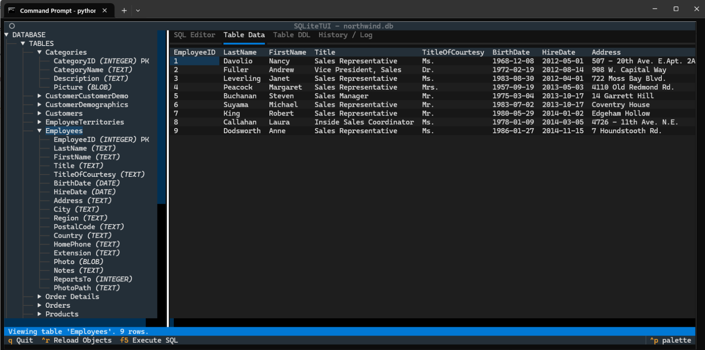

# **SQLiteTUI \- A Text-Based UI for SQLite**

**SQLiteTUI** is a fast, modern, and intuitive TUI (Text-based User Interface) for browsing and querying SQLite databases directly from your terminal. Built with Python and the powerful [Textual](https://github.com/Textualize/textual) framework, it provides a mouse-aware, keyboard-centric interface that makes database interaction a breeze without ever leaving your console.

## **Features**

* **Multi-Pane Layout:** A classic IDE-style layout with a database object tree on the left and a tabbed work area on the right.  
* **Database Object Explorer:**  
  * Browse tables and views in an organized, collapsible tree.  
  * View column names, data types, and constraints (PRIMARY KEY, NOT NULL).  
* **Powerful SQL Editor:**  
  * Write and execute complex, multi-statement SQL scripts.  
  * Syntax highlighting for SQL.  
  * View query results in a dedicated data grid within the same tab.  
* **Tabbed Interface:**  
  * **SQL Editor:** Your main workspace for writing queries.  
  * **Table Data:** View the full contents of any table or view with a single click.  
  * **Table DDL:** Instantly view the complete CREATE TABLE, CREATE INDEX, and CREATE TRIGGER statements for any object.  
  * **History / Log:** A persistent log of all executed queries and their outcomes, saved across sessions.  
* **Cross-Platform:** Works seamlessly on Linux, macOS, and Windows.

## **Why SQLiteTUI?**

While powerful GUI tools for SQLite exist, they often require you to leave the terminal, breaking your development workflow. SQLiteTUI is for developers who love the speed and efficiency of the command line but want a more visual and interactive way to work with their databases than the standard sqlite3 shell. It's lightweight, fast, and keyboard-driven, designed to boost your productivity.

## **Installation**

Simply download the source sqlitetui.py and :

pip install textual

## **Usage**

To start the application, simply provide the path to your SQLite database file as an argument:

python sqlitetui.py /path/to/your/database.db

### **Key Bindings**

* **F5**: Execute the script in the SQL Editor.  
* **Ctrl+R**: Reload the database schema in the object tree.  
* **Q**: Quit the application.  
* **Arrow Keys**: Navigate the object tree and data tables.  
* **Enter** (on object tree): Select an object to view its data and DDL.

## **Technology Stack**

* **Python 3.8+**  
* **Textual**: The TUI framework that powers the entire interface.  
* **sqlite3**: The standard Python library for SQLite interaction.

## **Contributing**

Contributions are welcome\! If you have ideas for new features, bug fixes, or improvements, please feel free to open an issue or submit a pull request.

## **License**

This project is licensed under the MIT License. See the LICENSE file for details.
